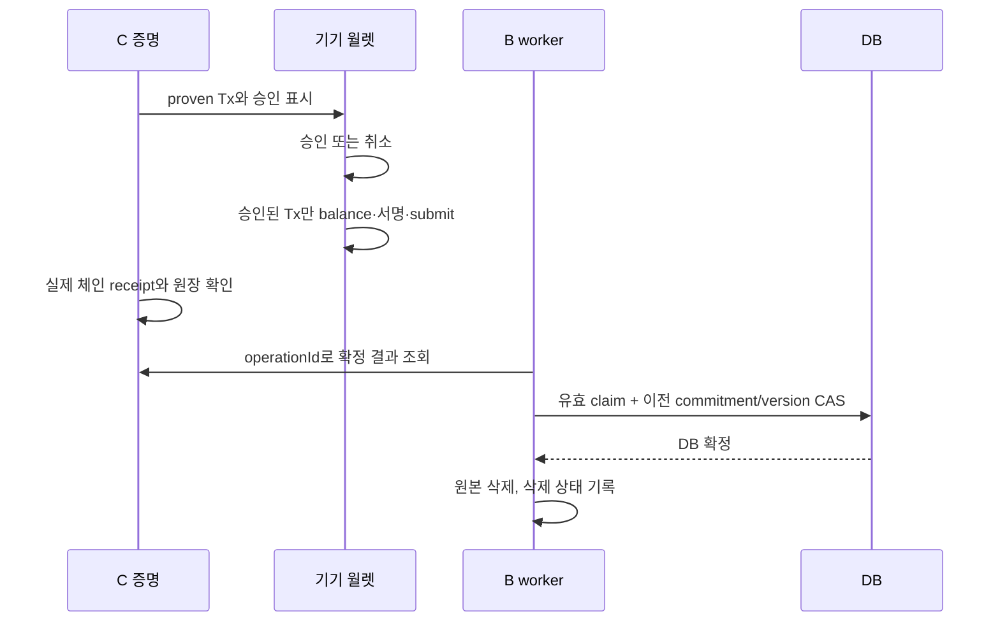

# C 6단계와 로컬 월렛·B 연결

사용자가 2026-09-18에 다음 연결과 최종 결과 증명을 진행한 뒤 Claude Midnight Expert로 교차검증하도록 요청했다. 제품 화면과 운영 API 추가는 별도 통합 범위다.

## 무엇을 증명하는가

`submitEvaluation`은 최신 확정 State opening을 다시 검사한다. 승인된 Rule hash와 scope, 누적 계산, version/tripCount, 최신 체인 commitment가 일치해야 한다. 진행 중인 운행과 genesis는 제출할 수 없다. 과거 원본 records를 다시 입력하지 않는다.

예시 Rule의 감점은 과속 2점·급가속 1점·급제동 3점이다. 두 운행 뒤 누적 550,000m, 이벤트 3·1·2이면 `100−(3×2+1×1+2×3)=87`점이다. 거리·점수 조건을 만족해 예상 할인은 1,000bps(10%)다. 이 값들을 비공개 결과 opening에 넣고 공개 원장에는 그 salted commitment만 기록한다. 보험사는 해당 opening과 실제 계약·체인 receipt를 함께 확인해야 한다. 해시 일치만으로 보험사의 적용 결정이 완료되지 않는다.

`hashEvaluation(ownerSecret, scope, ruleHash, stateCommitment)`가 nullifier다. 결과 salt를 바꿔도 같은 확정 State는 같은 nullifier를 만든다. `usedEvaluations`에 이미 있으면 거부한다. 새 State에는 새 nullifier가 생긴다. B의 pending/applied 상태와 재신청 사업 정책 전체를 이 Set으로 대신하지 않는다.

현재 adapter profile은 `drivacy-persistent-merkle10-c0311-r0160-v3-evaluation-owner`다. v2 교차검증에서 인증용 `ownerSecret()`과 nullifier용 호출이 서로 다른 witness 값을 받을 수 있음을 재현했다. v3는 비밀값을 한 번 읽고 동일한 값을 두 검사에 사용한다. 이전 v1/v2 deployment와 증거는 역사적 결과로 유지하며 기존 체인 계약 업그레이드로 표현하지 않는다.

## 월렛과 DB 순서

브라우저 모듈은 WebCrypto 난수 seed 생성, PBKDF2/AES-GCM 암호화와 IndexedDB 보관을 제공한다. 개인키는 브라우저 월렛 closure에서 사용한다. 승인한 proven Tx의 digest와 balance 입력을 비교하고 승인 ID는 한 번만 사용한다. 승인 ID 예약과 balance 승인 소비는 digest의 비동기 처리 전에 동기적으로 수행해 같은 승인으로 두 호출이 진행하지 못하게 한다. 계약 주소·entrypoint·네트워크도 검사한다. 화면은 직접 계산한 Tx digest를 표시하며 operation/State 표시는 어댑터 제공 정보임을 구분한다. B의 boolean이나 DB claim은 기기 월렛 승인이 아니다. XSS 방어·백업·다중 기기 복구는 이 로컬 구성 요소의 검증 범위가 아니다.

B의 `ChainFinalizer`는 기존 middleware가 인증한 User를 받는 내부 서비스다. 본인 계약·보험사·선택된 적용 가능 특약을 SQL에서 확인하고, 서버 내부 registered Rule과 요청 hash를 확인한다. DB 시간 기반 claim token과 만료, 이전 State commitment/version을 함께 검사한다. State 갱신과 작업 확정은 같은 DB transaction이다.

제출 전 취소된 작업은 B의 `abandoned`로 종료해 같은 scope의 다음 운행을 허용한다. C는 scope lock 안에서 모든 단계 journal을 확인하고 비재시도 terminal failure이며 거래 ID가 하나도 없을 때만 안전한 종료를 인정한다. 마지막 오류에 거래 ID가 없다는 이유만으로 이전 제출을 버릴 수 없다. 미확정 원본은 기존 실패 보관 정책대로 유지하며 확정 원본 삭제 경로를 사용할 수 없다.

일시 오류의 최초 시도와 1·5·15분 재시도까지 실패하면 `RETRIES_EXHAUSTED`로 종료한다. 이 경우에도 전체 journal에 거래 ID가 없어야 작업을 포기할 수 있다. 같은 abandoned 작업 ID의 생성 재요청은 `JOB_ABANDONED`로 거부하며, C 조회/잠금 오류는 `CHAIN_STATUS_UNAVAILABLE`로 처리해 확정되지 않은 상태를 임의로 해제하지 않는다.

DB 실패는 체인 실패와 다르다. C의 확정 결과를 재조회하여 DB만 재시도한다. Storage 삭제 실패는 이미 확정된 DB State를 되돌리지 않고 삭제만 재시도한다. 삭제 전에는 반드시 DB 확정 상태가 필요하다. source 포트의 반복 삭제는 성공해야 한다. C의 현재 witness 저장도 체인 확정 후 집계 opening으로 바꾼다. 파일 삭제와 현재 witness 교체는 백업·LevelDB 과거 page·메모리의 물리적 소거를 보장하지 않는다.

## 실행 및 증거 범위

`./scripts/check-driving-state.ps1 -Live -BrowserIntegration`은 새 임시 컴파일·의존성 하네스, 독립 Chromium 프로파일, loopback PostgreSQL fixture DB를 사용한다. 고정 DB 포트 55439가 비어 있어야 한다. PostgreSQL fixture에는 저장소 migration과 모의 계약만 적용하며, 종료 시 이번 실행이 만든 DB 컨테이너만 제거한다. 실제 Supabase에 새 migration을 적용하지 않는다.

브라우저 페이지는 공개·선입금 로컬 genesis seed를 쓰는 학습용이다. 운영 가입자 월렛이 아니며 사용자 브라우저/설치 월렛을 열지 않는다. Node의 배포 월렛도 동일한 공개 fixture다. 브라우저의 SDK balance·submit 호출 검증은 실제 가입자 provisioning·로그인·제품 화면·Supabase Storage E2E를 뜻하지 않는다.

`scripts/check-driving-linux.sh`는 별도 Linux 파일시스템에서 checksum을 확인한 Node 24.14.1, 빈 npm 캐시와 새 의존성, 새로 생성한 회로를 사용한다. 빠른 회로 검사는 `--skip-zk`이며 실제 proof/체인 근거는 Windows Live 실행의 finalized receipts와 구분한다. 독립 Python 기준 계산과 TypeScript 계산을 대조한다.

새 migration `20260918060000_chain_state_confirmation.sql`은 로컬 연결용이며 원격 미적용이다. 공개 업무 API·Cloud Tasks·보험사 승인/결정·Preprod 연결은 완료로 주장하지 않는다. 비공개 결과 opening의 보험사 전달·보관도 운영 신청 경로에 연결해야 한다.

2026-09-18 수정된 v3의 전체 ZK 컴파일(6회로)·strict 검사와 Windows/Linux 각각 102개 테스트가 통과했다. Linux 독립 기준 계산은 정상 332건·거부 15건을 통과했다. 추가 회귀 검사는 악성 witness의 호출별 비밀값 변경과 앞 단계 제출 이후의 잘못된 작업 포기를 검사한다. 마지막 TypeScript 보완 후 두 환경에서 102개를 다시 실행했고, 재시도 소진의 terminal 상태·안전한 작업 종료·다음 operation 시작도 확인했다. 기존 검사에 조건을 추가했으므로 테스트 개수는 그대로다. 브라우저 balance와 B 서비스의 실제 연결 검사는 이 102개에 포함되지 않는다.

수정 전 v2의 정상 witness 경로에서는 누적 550km·87점·예상 10% 최종 proof, 두 운행의 DB 확정·원본 삭제와 DB/삭제 실패 복구를 확인했다. proof 시도/성공 11회, 계약 제출 10회, 승인 포트 요청 9회였고 변조·누락·stale·정상 witness의 salt 변경 중복 평가 10건을 거부했다. 이 결과는 악성 witness에 대한 안전성을 입증하지 못했으므로 [수정 전 역사적 증거](evidence/final-evaluation-2026-09-18-before-owner-fix.json)로 분리했다. 비공개 opening·ownerSecret·원본·월렛 키는 export하지 않는다.

v3의 2026-09-18 첫 로컬 재검증은 Docker Desktop socket 오류로 중단됐으며 [당시 상태](evidence/final-evaluation-2026-09-18.json)를 역사적 기록으로 유지한다. 2026-09-20 stale runtime socket을 백업명으로 보존 이동한 뒤 전체 ZK 컴파일·strict 검사·106개 테스트와 실제 로컬 브라우저 월렛·격리 PostgreSQL 연결을 통과했다. 두 운행 revision 2, 최종 결과 proof/nullifier, 동시 balance 1회 제한, DB/삭제 실패 복구와 변조·중복 10건 거부를 확인했다. [최신 실행 증거](evidence/final-evaluation-2026-09-20.json)는 공개 receipt와 테스트한 소스 hash만 보관한다.

[Claude Midnight Expert 검토](evidence/midnight-expert-review-2026-09-18.md)는 완료했다. 비밀값 witness 바인딩과 동시 balance 소스 문제를 수정했고, 제출 전 취소·재시도 소진에는 안전한 작업 종료를 추가했다. 2026-09-20에는 남아 있던 두 항목도 보완했다. 이전 단계가 실제 반영된 terminal 운행은 전체 journal에 결과 불명 거래가 없고 `finishTrip`이 확정되지 않았을 때만 별도 월렛 승인 `cancelTrip`을 실행하며, 성공 receipt 이후에만 B가 scope를 해제한다. 취소 거래 결과 불명은 transaction ID로 복구하고 재제출하지 않는다. finalizer의 C 조회 실패/잘못된 status는 `CHAIN_STATUS_UNAVAILABLE`, 비공개 원본 payload 오류는 `SOURCE_PAYLOAD_INVALID`로 매핑한다. 재시도 예산은 합의한 작업당 세 번으로 유지한다.
