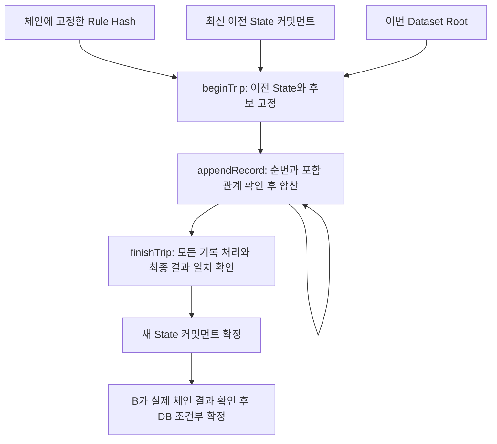

# C 4단계: 기록·규칙·누적 상태를 함께 증명하기

작성일: 2026-09-18 (KST)

사용자는 구현과 함께 원리·코드·검증 근거를 공부하기로 했다. 이 문서는
[실제 회로](../contracts/driving-state.compact)와
[State/Merkle 어댑터](../packages/midnight/src/state-adapter.ts)를
읽는 순서이자 B와 연결할 때의 실행 규격이다. 사업 정책을 새로 정하지 않는다.

## 먼저 증명할 문장을 정한다

“고정한 승인 Rule로 이번 Dataset의 모든 기록을 계산했고, 최신 이전 확정
State에 더한 값이 새 State와 일치한다.”

Core는 결과를 계산한다. 회로는 그 결과가 지켜야 하는 관계를 강제한다.
Core 결과를 그대로 커밋먼트로 만들어 저장하는 것만으로는 계산을 검증할 수 없다.
따라서 회로도 정수 누적·가중 감점·0점 하한·거리/점수 조건·할인 구간을 검사한다.



## 1. Hash, commitment, opening의 역할

- Rule Hash: 적용할 규칙의 식별자·버전·산식 단위·숫자 계수를 고정한다.
- Dataset Root: 이번 운행의 기록 묶음을 고정한다.
- State commitment: Scope·Rule·버전·누적값·결과·이번 Root·salt를 고정한다.
- opening: 커밋먼트를 확인할 실제 비공개 내용과 salt다.

`hashState`에서 opening을 다시 해시해 체인의 커밋먼트와 비교한다. 거리만
바꾸거나 salt만 바꿔도 같은 opening으로 인정되지 않는다. 작은 점수/거리의
추측 대조를 어렵게 하기 위해 비공개 32바이트 salt를 사용한다.

도메인 태그는 “Rule을 해시한 값”과 “State를 해시한 값”을 서로 구분한다.
`drivacy:rule:v1`, `drivacy:state:v1`, `drivacy:record:v1`, `drivacy:node:v1`
등을 32바이트로 padding하고 Compact의 `persistentHash`에 함께 넣는다.
Node.js에서 문자열을 임의로 해시해 회로 값이라고 표시하지 않는다.
어댑터는 컴파일된 `pureCircuits.hashRule/hashState/hashRecord/hashNode`를 호출한다.

## 2. 문자열 계약을 회로의 고정 타입으로 바꾸기

프로파일은 `drivacy-persistent-merkle10-c0311-r0160-v1`이다. compiler 0.31.1,
runtime 0.16.0, onchain-runtime 3.0.0, Midnight.js 4.1.1 조합을 사용한다.
실제 해시/커밋먼트는 32바이트 소문자 hex 64자다.

BC의 JSON 직렬화는 업무 계약의 고정 표현으로 유지한다. 실제 회로 해시는
UTF-8 JSON 전체에 대한 단순 SHA256이 아니라 아래의 **Compact 타입 인코딩**이다.

| 값 | 회로 표현 | 연결 책임 |
| --- | --- | --- |
| Rule 문자열 식별자·산식·단위 | 고정 순서 JSON 배열의 SHA256 identity digest | 어댑터/B가 승인본을 같은 방식으로 매핑 |
| Rule version·계수·조건·할인율 | RuleOpening의 정수 필드 | 회로가 전체 RuleOpening 해시를 등록 Hash와 비교 |
| Scope | 고정 순서 Scope + 비공개 owner secret의 SHA256 digest | B가 본인 객체 권한/기간/계약을 확인; 회로가 digest를 고정 |
| 운행 ID·모의 표시·수집 활성화 | 고정 순서 JSON identity digest | 어댑터는 simulated/true만 수용 |
| 운행 기록 수·Dataset salt·기록 순번·5개 집계 | TripOpening + RecordOpening | 회로가 leaf 재계산과 포함·합산 확인 |
| State | scope/rule digest, version/tripCount, Metrics, 결과, Root, salt | 회로가 이전/후보 opening과 커밋먼트 비교 |

문자열 digest의 JSON preimage나 Supabase 사용자 신원을 회로가 증명하는 것은
아니다. B의 인증된 매핑과 선택한 체인 계약 주소를 신뢰 경계로 명시한다.
권한 검사를 문자열 해시로 대체하지 않는다. 프로파일 변경은 계약/회로 변경이다.

## 3. Merkle 포함 검사만으로 끝내면 안 되는 이유

높이 10의 이진 트리는 1,024개 leaf 위치를 가진다. 어댑터는 records를 원래
순번으로 넣고 나머지는 `emptyLeaf()`로 채운다. `hashNode(left,right)`로
10개 층을 합쳐 Root를 만든다. genesis는 제출 Dataset과 구별한 empty sentinel이다.

각 기록은 10개의 sibling과 좌/우 방향으로 Root를 재계산할 수 있다.
`pathIndex`는 좌/우 비트를 `1,2,4,...,512`의 가중치로 합산해 leaf 위치를
구한다. 회로는 **기록 순번 = path 위치 = 현재 cursor**인지 함께 검사한다.

예를 들어 기록 0과 1 중 기록 0만 처리하면 포함 검사는 성공할 수 있다.
그러나 cursor는 1, recordCount는 2이므로 `finishTrip`은 거부된다.
기록 0을 두 번 처리하면 두 번째 cursor와 순번이 달라 거부된다.
원래 Dataset의 개수도 leaf의 TripOpening에 포함하므로 개수만 바꿔 Root를
재사용할 수 없다. 사용하지 않는 leaf의 canonical padding 생성은 어댑터의
책임이며 회로가 미사용 위치 전체의 empty 여부를 별도로 증명하지는 않는다.

Root는 **이번 운행**의 Root다. 과거 전체 원본을 한 트리에 계속 넣지 않는다.
과거는 이전 State 커밋먼트와 순차 검증으로 이어진다.

## 4. 시작 → 누적 → 확정으로 나누는 이유

Compact는 회로 크기가 컴파일 때 결정되는 bounded language다. 모든 1,024개
기록과 해시를 하나의 거대한 회로에 펼치는 대신 기록 하나씩 검증한다.
이는 새 사업 한도가 아니라 기존 1~1,024개 입력 계약을 처리하는 실행 방식이다.

| 회로 | 강제하는 관계 | 확정 State 영향 |
| --- | --- | --- |
| initialize | 고정 Rule/Scope, 0회·0집계 genesis, 시작 점수/조건, owner secret | 실제 초기 커밋먼트 생성 |
| beginTrip | 최신 이전 opening, 동일 Rule/Scope, 후보 version/tripCount +1, 초기 누적값=이전값 | 이전 State 유지; 목표·Root·개수 고정 |
| appendRecord | pending opening, cursor/순번/경로 위치, Dataset 포함, 새 누적값=기존+기록 | 이전 State 유지; 누적 커밋먼트/cursor만 갱신 |
| finishTrip | cursor=개수, 누적값=후보값, 후보 커밋먼트/결과 일치 | 새 State로 교체, revision +1 |
| cancelTrip | owner secret, active 상태 | 이전 State/revision 유지; pending 취소 |

중간 PendingOpening도 salt를 포함한 커밋먼트로 저장한다. 따라서 중간 집계를
공개하지 않으면서 다음 기록에 정확히 연결한다. 한 deployment는 하나의 Rule과
Scope를 고정하며 동시에 한 운행만 active로 처리한다.

실제 실행은 초기화 1회, 운행마다 begin 1회 + 기록 수만큼 append + finish 1회다.
다수 기록의 실행 비용/시간 최적화나 병렬 처리 성능을 검증한 구조는 아니다.
중간 트랜잭션 실패 후에는 active/cursor/pending 값을 조회하고 저장한 opening과
대조해야 한다. 새 salt를 생성해 begin부터 무조건 재제출하지 않는다.
현재는 명시적 로컬 실행 하네스이며 BCAdapter의 운영용 재시도/상태 조회 구현은 아니다.

## 5. 550km·87점을 손으로 확인하기

첫 운행: 거리 300,000m, 이벤트 과속/급가속/급제동 = 2/1/1.
감점은 `2×2 + 1×1 + 1×3 = 8`, 점수는 92다. 거리 조건은 미충족이지만
계산은 정확하므로 전이가 유효할 수 있다.

두 번째 운행은 두 기록으로 쪼갠다: 150,000m·1/0/0과 100,000m·0/0/1.
누적 거리는 550,000m, 누적 이벤트는 3/1/2다. 감점 `3×2 + 1×1 + 2×3 = 13`,
점수 87, 조건 충족, 예상 할인율 1,000bp(10%)다. 보험사의 적용 결정은 별개다.

0점 이후에도 이벤트를 지우지 않는다. 회로의 `calculatedScore`는 누적 이벤트에
대한 가중 감점에서 매번 재계산한다. Metrics는 Uint32이고 합산 뒤 checked cast로
overflow를 거부한다. 큰 가중 감점은 충분한 폭의 Uint로 계산하며 Field의
모듈러 연산이나 부동소수점으로 계산하지 않는다.

## 공개 정보와 남은 연결

공개 원장은 Rule/Scope/owner binding, 현재·pending·목표 State 커밋먼트,
Dataset Root, 초기화/active, 처리 기록 수·cursor·revision을 저장한다.
기록 수와 처리 진행은 공개되는 메타데이터다. 정확한 거리·점수·이벤트·원본·salt·
개인 식별 문자열은 ledger에 저장하지 않는다. 증명 서버는 로컬 처리 영역이다.

공개 `datasetRoot/recordCount/cursor`는 가장 최근 시작한 운행의 처리 메타데이터다.
genesis에서는 기본값이고 cancel 이후에도 마지막 처리 값이 남을 수 있다.
최신 **확정** Dataset은 State opening 안의 Root와 `stateCommitment`로 식별한다.
B는 메타데이터만 보고 확정하지 않고 finish receipt·커밋먼트·후보 Root를 함께 확인한다.

owner secret 지식을 회로에서 요구하지만, 실제 가입자 월렛 승인/소유권과의
연결은 후속 SDK 인터페이스 작업이다. 로컬 하네스는 공개된 개발용 genesis
월렛과 임의 개발 secret을 사용한다. 사용자 개인키나 운영 계정을 사용하지 않는다.

Rule은 deployment의 immutable Hash로 등록된다. 실제 보험사 승인 권한과
해당 deployment를 선택할 권한은 B가 연결한다. 하네스의 demo 승인 객체가
실제 보험사 승인/인증을 증명하는 것은 아니다.

최종 보험사 결과 공개 연결·신청 nullifier, Preprod, 브라우저 월렛 승인,
B의 DB 조건부 확정·원본 삭제와 자동 재시도는 이번 운행 회로와 구분한다.
실제 운행 여부·미제출 기록·원본 삭제 사실은 이 증명으로 보장하지 않는다.

## 실행과 검증 기록

```powershell
# 빠른 회로 실행/타입/회귀 검사. 증명용 키는 만들지 않는다.
./scripts/check-driving-state.ps1 -SkipZk
# 전체 ZK 컴파일 + 타입 검사 + 회로/계산/공유 계약 테스트
./scripts/check-driving-state.ps1
# 위 검사 이후 실제 로컬 배포·증명·두 운행 확정
./scripts/check-driving-state.ps1 -Live
```

새 임시 폴더에서 실행하며 root workspace/lockfile을 바꾸지 않는다.
Node.js 24·npm·WSL2 compiler 0.31.1이 필요하다. Live는 Docker Desktop Linux
engine과 기존 로컬 node/indexer/proof-server 설정을 사용한다. 패키지 다운로드는
있을 수 있지만 LLM·유료 Provider·운영 데이터 호출은 없다.

컴파일된 JS 회로 검사는 proof 생성이나 체인 검증을 실행한 것이 아니다.
Live 하네스는 실제 finalized receipt와 원장 값으로 확인한 뒤 BC의 확인 결과를
조립하고 `canFinalizeState`의 일관성 검사를 실행한다. 이것이 B의 실제 DB
트랜잭션 실행을 뜻하지는 않는다. 변조 요청은 SDK의 회로 실행에서 증명 요청
전에 거부되는지 별도로 확인하며, 잘못된 raw proof를 노드에 직접 제출한
검사로 표현하지 않는다.

2026-09-18 새 임시 하네스에서 전체 ZK 컴파일·strict TypeScript 검사와
72개 테스트(회로 19, Core 27, 공유 계약 26)가 통과했다. 회로 테스트는 두 운행
연결, 점수/Rule/Scope/이전 opening/owner 변조, 기록/경로/순번 조작,
누락/중복/가짜 누적·후보 합산, cancel 후 이전 상태 유지, 재확정 거부,
uint32 overflow·큰 가중 감점, 최대 1,024개 Dataset의 첫/마지막 경로를 확인한다.

실제 로컬 실행에서는 deployment·initialize·첫 운행 3회(begin/append/finish)·
두 번째 운행 4회(begin/append 2회/finish), 총 **9회의 증명 요청과 계약 제출**이
성공했다. 각각 finalized receipt와 원장을 확인했고, revision 2·두 운행의 누적
550,000m·87점·예상 1,000bp, B↔C 일관성 검사와 계약 재연결을 확인했다.
점수·Rule·이전 opening·owner 변조 4건, 두 운행의 누락/기록 변조 각 2건,
오래된 상태 재사용 1건, 총 9건은 proof provider 요청/제출 횟수와 원장 변화가
없었다. 이는 SDK 회로 실행에서 거부된 검사이며 invalid raw proof 제출 검사는 아니다.

Live의 모의 records는 첫 운행 1개, 두 번째 2개다. cancel과 1,024개 전체
운행의 실제 체인 실행/성능을 검증한 것으로 표현하지 않는다. 유료 Provider/LLM
호출은 0회다. 서비스 운영 구현·Preprod·가입자 브라우저 월렛 E2E는 포함하지 않는다.
[실행 증거·소스 SHA256·증명용 키 해시](evidence/driving-state-2026-09-18.json)를 보관한다.

후속 학습 요청으로 회로·어댑터·Live 하네스에 한국어 설명 주석을 추가했다.
위 실행 증거의 소스 SHA256은 주석 추가 전 실제 검증본을 그대로 유지한다.
그 검증본과 주석 추가 시점 파일의 주석/공백 제외 코드가 일치하고, 주석을 추가한 Compact의
`--skip-zk` 컴파일도 통과했다. 이 주석 작업에서 Live 검증을 다시 실행하지는 않았다.
이후 C 5단계에서는 로컬 실행기에 승인·작업 저장·복구 코드를 연결했다.
그 동작 변경의 별도 검증은 [월렛 승인·작업 제어 문서](WALLET_APPROVAL_JOBS.md)를
따르며, 위 4단계의 소스 해시·receipt를 5단계 실행 증거로 대체하지 않는다.

## 직접 확인한 공식 근거

- [Compact language reference](https://docs.midnight.network/compact/reference/compact-reference):
  고정 크기 회로, witness, 공개 ledger, 명시적 disclose와 정수 타입.
- [Compact source](https://github.com/LFDT-Minokawa/compact): 컴파일/회로 구조의 공식 소스.
- 설치한 `@midnight-ntwrk/compact-runtime@0.16.0`의 `built-ins.d.ts`:
  지속 상태에 persistentHash/Commit 사용, transientHash의 업그레이드 비보장.
- [기존 실제 로컬 검증](MIDNIGHT_LOCAL_PROBE.md): SDK·서비스 연결과 고정 버전 근거.
