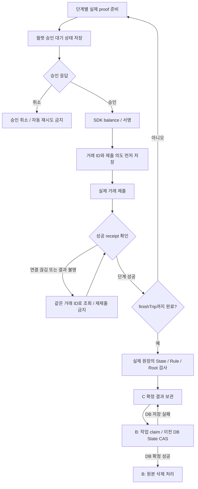

# C 5단계: 월렛 승인과 운행 작업 제어

2026-09-18. C가 담당하는 승인 인터페이스·단계별 작업 기록·재조회 경로를
구현한다. 가입자 화면은 A, 인증·객체 권한·작업 claim·DB 확정·삭제는 B의
영역이다. 현재 실행기는 로컬 개발 월렛을 사용하며 가입자 브라우저 E2E나
B의 서버/DB가 연결됐다는 뜻은 아니다.

## Wallet Provider 경계 — 2026-09-23 정리

`WalletApproval`은 `TripJob`이 증명 뒤 `awaiting-wallet-approval` 상태에서 요청하는 가입자 승인 결정만 담당한다. 요청에는 `approvalRequestId`, `operationId`, `tripId`, network, chain contract address, step, 이전/신규 State commitment가 모두 포함된다. 취소는 기존 `APPROVAL_CANCELLED` terminal 결과이며 자동 재시도 대상이 아니다.

`packages/midnight/src/wallet-provider.ts`는 두 연결 경로를 분리한다. `LocalBrowserWalletApproval`은 현재의 개발/검증용 local browser wallet UI를 같은 승인 경계에 연결한다. `UserWalletApproval`과 `UserWalletProvider`는 향후 실제 가입자 Wallet Provider가 구현할 connect, initialize, transaction approval, balance/sign, submit, cancel, disconnect 경계를 선언한다. 이 단계에서 Lace SDK나 실제 가입자 Provider는 연결하지 않았다.

실제 Provider는 proven transaction의 digest와 승인 요청을 함께 표시·결합해야 하며, private key, seed, secretKey를 반환하거나 Backend/C 처리 서버로 전송해서는 안 된다. Local browser wallet은 production 가입자 wallet이 아니라 기존 local probe의 개발·검증 도구다. 기존 `wallet-runtime.ts`가 network/action 검사, approvalRequestId 일회성 사용, digest binding, 승인 전 balance/submit 차단, DUST 준비, stop cleanup을 계속 강제한다.

### Lace DApp Connector v4 browser adapter — 2026-09-23 구현

`packages/midnight/browser/lace-wallet-provider.ts`는 설치한 `@midnight-ntwrk/dapp-connector-api@4.0.1`의 실제 타입을 사용한다. provider는 특정 global key를 전제하지 않고 `window.midnight`의 모든 Initial API를 읽어 `name`·`rdns`·`apiVersion`으로 Lace v4 후보를 찾는다. `lace`와 `mnLace` key는 호환용 후보 판별 신호일 뿐 단일 의존점이 아니다. 다수 후보는 임의 선택하지 않고 오류로 닫는다.

adapter는 `connect("preprod")` 뒤 `getConnectionStatus()`와 `getConfiguration()`의 network를 모두 확인한다. Wallet configuration의 indexer·indexer websocket·prover(있을 때)·node URI를 그대로 사용하며, 호출자가 기존 Drivacy endpoint를 지정한 경우 URI가 다르면 `WALLET_SERVICE_URI_MISMATCH`로 중단한다. local/undeployed는 계속 local browser wallet 경로만 사용한다.

v4의 `balanceUnsealedTransaction()`은 wallet이 balance/sign 승인 UI를 여는 지점이다. adapter는 proven transaction의 action을 기존 `wallet-runtime.ts`로 먼저 확인하고, approvalRequestId·pre-balance digest를 한 번만 연결한 뒤 balance/sign을 요청한다. 승인 전 balance, 다른 transaction, 재사용 ID, balance 전 submit은 거부한다. `submitTransaction()`은 v4에서 void이므로 adapter가 반환하는 SHA-256은 chain transaction ID가 아닌 local submission reference다. 실제 chain 결과가 불명이면 기존 `chain-unknown` 조회 규칙을 따른다.

`lace-wallet.html`/`lace-wallet-page.ts`는 browser 수동 검증용 페이지다. preprod Lace 발견·연결·공개 unshielded address·Wallet service URI·사용자가 붙여 넣은 proven unsealed transaction의 balance/sign 승인만 확인하며, transaction submit은 실행하지 않는다. 제품 가입자 UI나 Expo native 기능이 아니며, 실제 Lace browser E2E와 Preprod transaction 성공은 아직 검증 기록에 포함하지 않는다.

## 먼저 이해할 예시

기록이 1개인 첫 운행은 `beginTrip → appendRecord:0 → finishTrip`의 세 거래다.
두 번째 운행의 기록은 2개이므로 네 거래다. 각 거래의 서명·수수료 처리를
시작하기 전에 해당 단계의 승인을 요청한다. 로컬 실행에서의 승인 주체는
명시적으로 **개발 실행기**이며 가입자 승인을 흉내 내 실제 승인으로 기록하지 않는다.
가입자 화면의 승인 표시·버튼·인증된 UI 응답 연결은 A와 통합할 영역이다.

고정 Midnight.js 4.1.1의 설치 소스에서 `submitTxCore` 순서는
`proveTx → balanceTx → submitTx`다. 승인 검사는 `balanceTx` 직전에 둔다.
승인 취소로 서명·제출을 막아도 그 전에 로컬 증명 연산이 이미 수행됐을 수 있다.
이 검증은 유료 외부 proof 서비스를 호출하지 않는다.

가령 마지막 거래 제출 직후 indexer 연결이 끊기면 두 가지 가능성이 있다.
체인에 반영됐을 수도 있고, 아직 반영되지 않았을 수도 있다. 오류만 보고
다시 서명·제출하면 같은 운행을 반복하려 하므로, 제출 전에 저장한 거래 ID로
먼저 조회한다. `not found` 한 번이나 timeout만으로 실패를 단정하지 않는다.

체인 성공 후 B의 DB 저장만 실패한 경우는 더 간단하다. C가 보관한
`chain-confirmed` 결과를 같은 작업 ID로 다시 조회하고 B의 DB 확정만 재시도한다.
증명 생성·가입자 승인·체인 제출을 다시 수행하지 않는다.

## 코드와 그 근거

- `packages/midnight/src/trip-job.ts`: `TripJob`은 승인·제출·확정 결과를
  기존 B↔C 상태 스키마로 반환한다. 키·SDK·네트워크는 직접 소유하지 않는다.
- `WalletApproval.request`: 작업 ID·운행 ID·네트워크·계약·단계·이전/신규
  커밋먼트를 전달한다. 다른 단계나 다른 계약의 승인을 재사용하지 않는다.
- `runStep`: 정해진 단계 순서를 지키고 `balance` 앞에 승인 검사를,
  `submit` 앞에 거래 ID 기록을 둔다. 이미 성공한 단계는 저장된 receipt를 반환한다.
- `getStatus`: 승인을 기다리는 동안에도 저장된 상태를 조회할 수 있다.
  실행 잠금이 있다고 상태 조회까지 막으면 B는 사용자 대기를 구분할 수 없다.
  `getTripStatus(store, operationId)`는 원본이나 candidate 없이 작업 ID만으로 결과를 읽는다.
- `recoverStep`: 신뢰된 C 어댑터가 실제 성공 receipt를 검증한 뒤 호출한다.
  B나 브라우저에서 임의로 받은 `success` 값을 전달하는 외부 API가 아니다.
- `rejectStep`: C가 해당 거래의 확정 실패를 확인한 경우에만 사용한다.
  조회 timeout은 `chain-unknown`이며 이 함수에 넣지 않는다.
- `confirm`: 모든 단계 성공과 마지막 receipt의 거래/블록 ID, B↔C 연결 기준을
  검사한다. 호출자는 그 전에 실제 원장을 검사해야 한다. 이 함수 자체가
  indexer를 조회하거나 임의 receipt의 진위를 증명해 주지는 않는다.

운행 회로의 단계별 구조와 계산은 [4단계 학습 문서](STATE_TRANSITION_PROOF.md)를
따른다. 회로·공유 스키마·사업 산식은 이번 작업에서 변경하지 않는다.
SDK 1.2.0의 설치된 구현에서 `submitTransaction`은
`tx.identifiers().at(-1)`을 반환하는 것을 확인했고, 로컬 실행기는 제출 전에
같은 ID를 기록한다. 공식 [Wallet SDK 저장소](https://github.com/midnightntwrk/midnight-wallet)
및 [Midnight.js 저장소](https://github.com/midnightntwrk/midnight-js)를 참고하되,
최신 main의 API를 기존 고정 버전에 그대로 대입하지 않는다.

## 저장·동시 실행·재시도

같은 작업 ID에 다른 입력·후보 State·salt를 넣으면 `IDEMPOTENCY_CONFLICT`다.
동일 Scope에 처리 중인 다른 작업이 있으면 `SCOPE_BUSY`다. 작업 재개 시에는
최초 `prepareTrip`에서 만든 candidate와 비공개 witness 입력을 재사용한다.
저장소에 raw records·Dataset salt·ownerSecret·월렛 개인키를 복사하지 않는다.

저장되는 candidate에는 누적 State와 `stateSalt`가 있으므로 **비공개 처리
영역의 자료**다. 보험사 공개 응답·로그·작업 메시지에 작업 journal을 넣지 않는다.
B 작업 메시지는 기존대로 작업 ID만 담는다.

`LocalJobStore`는 임시 하네스용 JSON 저장소다. 파일의 배타 잠금으로 실행을
직렬화하고 같은 디렉터리의 임시 파일을 rename해 부분 JSON 노출을 피한다.
현재는 저장소 전체를 잠그므로 서로 다른 Scope도 동시에 실행하지 않는다.
Unix 파일 mode 0600을 요청하지만 Windows의 접근 제어·암호화나 운영 저장소
보안을 대신하지 않는다. 로컬 모의 State만 저장하며 journal은 실행 증거로
레포에 복사하지 않는다. 원자적 파일 교체는 전원 장애에 대한 내구성 보장이 아니다.

프로세스 강제 종료 뒤 남은 lock은 자동 탈취하지 않는다. 해당 프로세스가
종료됐는지 확인하고 수동 복구한 뒤, 저장된 거래 ID부터 조회해야 한다.
운영에서는 B/C가 연결할 저장소가 `JobJournalStore`의 잠금·원자적 기록 계약을
충족해야 한다. 이 로컬 잠금을 Cloud Run의 분산 claim/lease 구현으로 표현하지 않는다.

제출 전 오류는 어댑터가 확인한 경우에만 `failBeforeSubmission`으로 분류한다.
`TEMPORARY_FAILURE`에는 기존 합의의 1·5·15분 대기와 최대 3회 추가 시도를
적용한다. `getRetryInfo`로 다음 시각을 읽고 B 스케줄러가
`retryTemporaryFailure`를 호출한다. C가 별도 백그라운드 스케줄러를 만들지는 않는다.
입력·증명 무효와 승인 취소는 자동 재시도하지 않는다. 제출 ID가 있는 오류는
일시적 실패로 바꿔 자동 재시도할 수 없으며 체인 상태부터 확인한다.

`beginTrip` 뒤 사용자가 다음 단계 승인을 취소하면 이전 확정 State는 유지되지만
회로의 pending 운행은 남을 수 있다. 자동으로 취소 거래를 서명하지 않는다.
가입자 승인을 받아 기존 `cancelTrip` 회로를 호출하고 실제 취소 성공을 확인하는
운영 복구 연결은 별도다. 그 전까지 다른 운행으로 pending 작업을 덮지 않는다.

## B와 A가 연결할 부분

1. B는 객체 권한을 확인하고 작업을 claim한 뒤 비공개 처리 입력을 C에 전달한다.
2. C는 한 번 준비한 candidate/witness를 보관하고 단계마다 실제 SDK 호출을 감싼다.
3. A의 가입자 UI는 `WalletApproval`을 구현하고 자체 보관형 월렛에서만 서명한다.
   가입자 개인키를 B/C 서버에 보내거나 저장하지 않는다.
4. C는 실제 receipt와 원장을 검사하고 `confirm` 결과를 B에 제공한다.
5. B는 `canFinalizeState`와 신뢰된 C 결과·작업 claim·이전 DB State를 확인해
   트랜잭션으로 조건부 확정한다. B 저장 실패 시 같은 C 결과를 다시 조회한다.
6. DB 확정·원본 삭제의 각 결과는 B가 별도로 추적한다. C 성공을 원본 삭제 증거로 삼지 않는다.

REST 경로·Supabase 테이블·B 작업 스케줄러·A 화면은 이번 C 구현에 추가하지 않는다.
운영용 `BCAdapter` 전체와 가입자 키 복구·Preprod E2E 완료를 주장하지 않는다.

## 실행과 검증 기록

PowerShell의 `./scripts/check-driving-state.ps1 -Live`는 새 임시 하네스에서
전체 컴파일·strict 타입 검사·기존 회귀와 작업 제어 테스트를 실행하고,
실제 로컬 SDK 거래를 승인/저장 훅으로 감싸 두 운행을 처리한다.
`-SkipZk`는 실제 proof·체인 제출 없는 빠른 검사다.

작업 제어 테스트의 receipt는 **합성값**이다. 승인 대기 조회·취소·승인 없는 제출
차단·ID 선기록·결과 불명 복구·동시 실행 차단·입력 충돌·단계 순서·receipt 연결·
DB 저장 실패 가정 후 결과 재조회·재시도 시각과 횟수를 검증한다.
실제 체인 실행은 개발 월렛 승인으로 별도 확인하며 가입자 승인 E2E와 구분한다.

2026-09-18 전체 ZK 컴파일·strict 타입 검사·88개 테스트가 통과했다.
구성은 작업 제어 16·회로 19·Core 27·공유 계약 26개다.
실제 로컬 개발 월렛의 proof/계약 제출 각 9회와 승인 요청 7회로 두 운행을
revision 2까지 확정했다. 잘못된 요청 9건은 추가 proof 요청·제출 없이 거부했다.

실제 beginTrip 성공 후 결과 반환 장애를 주입했고 `chain-unknown`에서 실제
receipt·원장 확인 후 추가 승인·proof·제출 없이 복구했다. 운행 확정 뒤 새 객체와
파일 저장소에서 같은 결과를 재조회해 B 저장 실패 가정의 재제출 방지도 확인했다.
실제 B DB 장애나 가입자 UI E2E를 실행한 것은 아니다.

첫 Live 실행은 중간에 종료됐고, 다음 실행은 Docker 서비스 부재로 health 전에
실패했다. 이 기록을 성공 횟수에 합산하지 않는다. Docker의 오래된 socket을
백업으로 보존한 뒤 재기동해 새 디렉터리에서 검증을 완료했다. 전체 컴파일한
ZK assets와 고정 dependencies를 재사용했으며 새 Live 소스의 해시도 비교했다.

[별도 공개 실행 증거·소스/ZK 키 해시](evidence/wallet-jobs-2026-09-18.json)를
보관한다. 비공개 journal과 State opening은 이 증거 파일에 포함하지 않는다.
4단계 증거의 소스 해시·receipt는 과거 검증 기록으로 그대로 보존한다.

## 작업 방식 점검 — 2026-09-18

사용자 요청으로 접근 방식 자체도 점검했다. 기존 순서의 C 5단계만 구현하고,
한국어 설명/주석 → strict 검사와 회귀 → 실제 로컬 SDK 실행 순서로 검증하는
방식은 범위와 원인 구분에 맞는다. 승인·DB 역할을 C가 대신하지 않는 것도
자체 보관형 월렛과 B/C 분담 기준에 맞는다.

다만 합성 receipt의 복구 테스트만으로 실제 체인 복구를 주장할 수는 없다.
실제 beginTrip 성공 직후 결과 반환에 장애를 주입하고 원장·receipt를 확인해
재제출 없이 복구하는 Live 검사를 추가했다. 이것은 실제 node/indexer 네트워크
장애 전체나 운영 서버 재시작 복구를 검증하는 것은 아니다.

현재 구현은 C의 작업 제어 구성 요소이며 5단계의 전체 통합 완료가 아니다.
가입자 승인 UI/SDK, 신뢰된 상태 조회 경로, 비공개 witness/candidate의 최초값
재사용 저장, 운영 저장소 claim/내구성, B의 DB CAS·삭제까지 연결해야 한다.
구성 요소의 테스트가 통과하더라도 이 경계를 생략하지 않는다.

후속 승인으로 기기 브라우저 월렛 모듈과 B의 DB CAS·claim·삭제 내부 서비스를
추가했다. 위 5단계 receipt와 소스 해시는 당시 검증 결과로 유지한다. 새 연결의
실행 결과와 실제 가입자/운영 통합의 구분은 [FINAL_EVALUATION.md](FINAL_EVALUATION.md)를 따른다.
